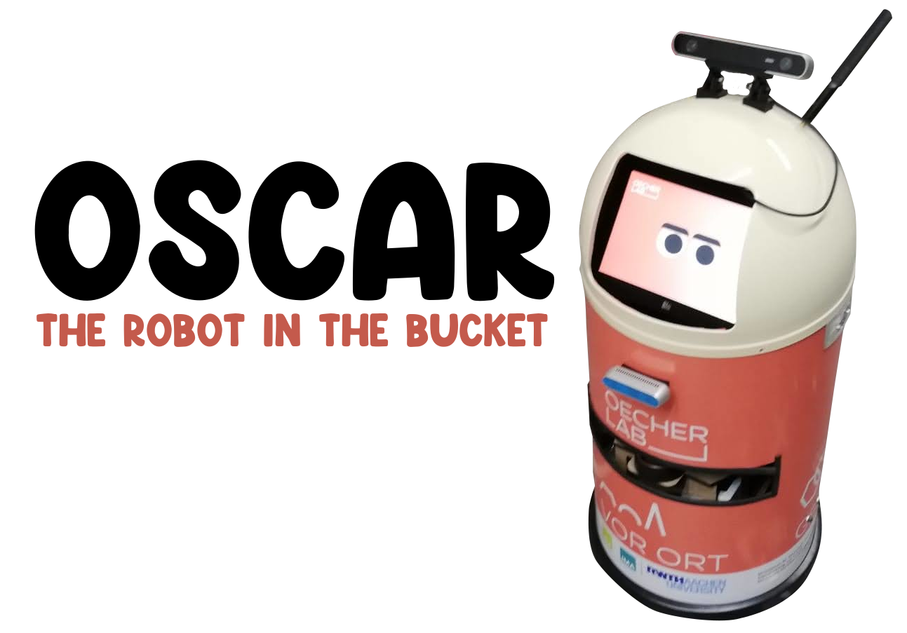
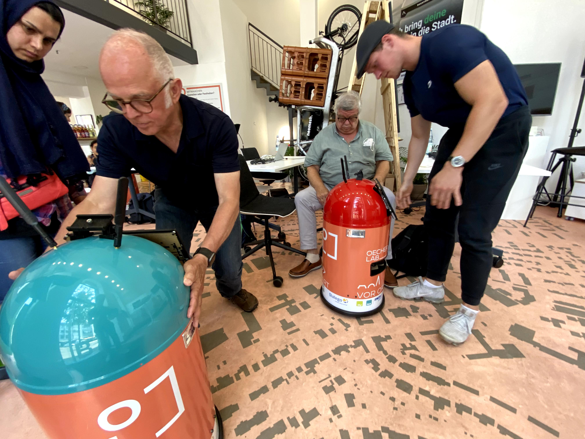
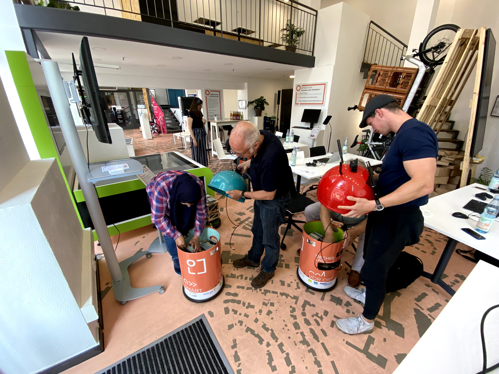
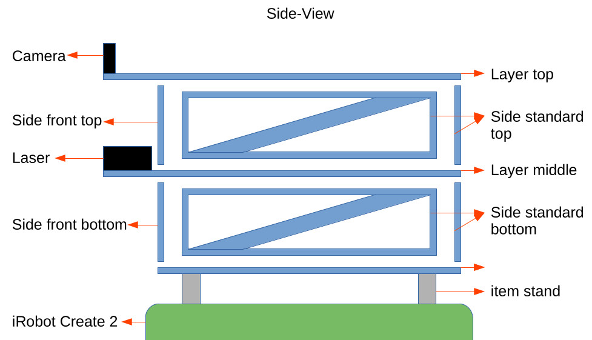

# oscar_robot

## Content

- [oscar_robot](#oscar_robot)
  - [Introduction](#introduction)
  - [**!!! CAUTION !!!**](#-caution-)
  - [Knowledge requirement](#knowledge-requirement)
  - [Shopping-List](#shopping-list)
    - [Budget Build Parts](#budget-build-parts)
    - [Original Build Parts](#original-build-parts)
    - [Laser-cutted parts](#laser-cutted-parts)
    - [3-D printed parts](#3-d-printed-parts)
  - [Build your robot](#build-your-robot)
    - [Hardware installation](#hardware-installation)
      - [Budget Build](#budget-build)
      - [Original Build](#original-build)
  - [Setup software](#setup-software)
    - [Budget Build (Raspberry Pi)](#budget-build-raspberry-pi)
    - [Original Build (Intel NUC)](#original-build-intel-nuc)
    - [Connect to Oscar via SSH](#connect-to-oscar-via-ssh)
    - [Installing ROS](#installing-ros)
    - [OSCAR workspace](#oscar-workspace)
    - [Connect Gamepad](#connect-gamepad)
  - [Usage](#usage)
    - [Teleoperation](#teleoperation)
    - [Mapping](#mapping)
    - [Navigation](#navigation)
  - [Publishing own navigation goals](#publishing-own-navigation-goals)
  - [Credits](#credits)

## Introduction

The "Oecher Lab" project is funded by the state of NRW, Germany as part of the "Digital Model Regions in NRW" program.

Oscar is a learning robot developed as part of the research project OecherLAB. Oscar is used to teach the Robot Operating System. It owes its name to its outer shell: the garbage can in which a well-known children's hero lives.

This documentation should enable everyone to rebuild and configure the robot, as well as to dare the first steps with ROS.

https://user-images.githubusercontent.com/32275/184821746-e5f2bd64-7a9f-4834-b20b-766fcd85903a.mp4

<table class="tg">
<thead>
    <td></td>
    <td></td>
</thead>
</table>

---

## **!!! CAUTION !!!**

**This tutorial contains instructions for working with electricity, soldering irons and sharp objects. Incorrect handling can lead to serious physical injuries. Please read about how to work safely with these topics before proceeding.**

---

## Knowledge requirement

- basic knowledge in Ubuntu Linux
- basic knowledge in ROS
- manual skills

## Shopping-List

In this chapter we describe the hardware you need to build your own Oscar. We build the Robot with powerful hardware to execute cutting edge algorithms (which are not part of this tutorial). If you just want to build the robot for getting in touch with ROS and the navigation stack, you can choose to build the budget build.

### Budget Build Parts

|Type | Product |
|-----|---------|
|Robot Base|iRobot Create 2 (EOL/AfterMarket)|
|Embedded Computer|[RaspberryPi 4 (4GB)](https://www.google.de/search?tbm=shop&hl=de&q=raspberry+pi+4+4gb) + [64GB microSD Card (dont buy fakes from Aliexpress)](https://www.google.de/search?tbm=shop&hl=de&q=64GB+micro+SD+Card)|
|2D Lidar|[RPLidar A2M8](https://www.google.de/search?tbm=shop&hl=de&q=rplidar+a2m8)|
|RGBD Camera|[Intel Realsense d435i](https://www.google.de/search?tbm=shop&hl=de&q=realsense+d435i)|
|Gamepad|[Sony Dualshock 4 Controller](https://www.google.de/search?tbm=shop&hl=de&q=sony+dualshock+4)|
|DC/DC Converter|[Sunfounder Step-down DC-DC Converter Module for Raspberry Pi](https://www.robotshop.com/de/de/sunfounder-step-down-dc-dc-wandlermodul-raspberry-pi.html)|
|USB-C cable|[Generic USB-C Cable](https://www.google.de/search?tbm=shop&hl=de&q=usb-c+cable)|
|USB-A hub|[Generic USB-3.0-hub](https://www.google.de/search?tbm=shop&hl=de&q=usb+a+3.0+hub)|
|Battery|[Turnigy 5000mAh 6S LiPo](https://hobbyking.com/de_de/turnigy-5000mah-6s-40c-lipo-pack-xt90.html)|
|Charger|[Generic 6S LiPo Charger](https://www.google.com/search?q=lipo+charger+b6&source=lmns&tbm=shop)|
|Cable + Plug|[XT90 Plug (male) + cable](https://www.google.de/search?tbm=shop&hl=de&q=xt90+male+with+cable)|

### Original Build Parts

|Type | Product |
|-----|---------|
|Robot Base|iRobot Create 2 (EOL/AfterMarket)|
|Roboter Body|[Wesco Pushboy](https://www.google.de/search?tbm=shop&hl=de&q=wesco+pushboy)|
|PC|[Intel NUC](https://www.google.de/search?tbm=shop&hl=de&q=intel+nuc+i5)  + [32GB DDR4-SODIMM 2666MHz](https://www.google.de/search?tbm=shop&hl=de&q=32gb+ddr4+sodimm+2666) + [512GB M2 SSD](https://www.google.de/search?tbm=shop&hl=de&q=32gb+ddr4+sodimm+2666)|
|AI PC|[Nvidia Jetson Nano](https://www.google.de/search?tbm=shop&hl=de&q=nvidia+jetson+nano)|
|Router|[Teltonika RUTX12](https://www.google.de/search?tbm=shop&hl=de&q=teltonika+rutx12)|
|2D Lidar|[RPLidar A2M8](https://www.google.de/search?tbm=shop&hl=de&q=rplidar+a2m8)|
|RGBD Camera|[Intel Realsense d435i](https://www.google.de/search?tbm=shop&hl=de&q=realsense+d435i)|
|Gamepad|[Sony Dualshock 4 Controller](https://www.google.de/search?tbm=shop&hl=de&q=sony+dualshock+4)|
|DC/DC Power Supply|[DCDC-USB, Intelligent DC-DC converter with USB interface](https://www.mini-box.com/DCDC-USB) + [Male DC Plug 5.5mm x 2.1mm](https://www.google.de/search?tbm=shop&hl=de&q=male+dc+plug)|
|Fuse Distribution Board|[Generic Distribution Board](https://www.google.de/search?tbm=shop&hl=de&q=fuse+distribution+board)|
|Molex cable|[Molex MicroFit Cable](https://www.google.de/search?tbm=shop&hl=de&q=4pin+molex+microfit+cable)|
|USB-C cable|[Generic USB-C Cable](https://www.google.de/search?tbm=shop&hl=de&q=usb-c+cable)|
|USB-A hub|[Generic USB-3.0-hub](https://www.google.de/search?tbm=shop&hl=de&q=usb+a+3.0+hub)|
|Ethernet Cable|[Ethernet Cable 0.4m](https://www.google.de/search?tbm=shop&hl=de&q=ethernet+cable)|
|WiFi Antenna Extension|[WiFi Antenna Extension](https://www.google.de/search?tbm=shop&hl=de&q=sma+extension)|
|Battery|[SLS 16000mAh 6S LiPo](https://www.stefansliposhop.de/akkus/sls-multirotor-uav/sls-xtron/sls-xtron-16000mah-6s1p-22-2v-20c-40c::2214.html)|
|Charger|[Generic 6S LiPo Charger](https://www.google.com/search?q=lipo+charger+b6&source=lmns&tbm=shop)|
|Cable + Plug|[XT90 Plug (male) + cable](https://www.google.de/search?tbm=shop&hl=de&q=xt90+male+with+cable)|

### Laser-cutted parts

The Create 2 base from iRobot has mounting points on its top plate. We use these points to attach a self developed lasercutted wooden construction. You can build your own top-construction for the raspberry pi/nuc and sensors, but we also provide the CAD files in the following table. You have to search for a company in your place to cut these parts for you.

Material thickness: 6 mm

| Qty | Type | Download |
|-----|------|----------|
|1x|Layer bottom|[Download](docs/cad/layer_bottom.dxf)|
|1x|Layer middle|[Download](docs/cad/layer_middle.dxf)|
|1x|Layer top|[Download](docs/cad/layer_top.dxf)|
|3x|Side standard bottom|[Download](docs/cad/side_standard_bottom.dxf)|
|3x|Side standard top|[Download](docs/cad/side_standard_top.dxf)|
|1x|Side front bottom|[Download](docs/cad/side_front_bottom.dxf)|
|1x|Side front top|[Download](docs/cad/side_front_top.dxf)|

### 3-D printed parts

We provide a STL-File for mounting the Intel Realsense camera to the top plate. You have to print it by yourself or find a company in your area which can print it for you.

| Qty | Type | Download |
|-----|------|----------|
|1x|Realsense mount|[Download](docs/cad/realsense_mount.stl)|

## Build your robot

To build your robot is quiet easy. You just have to slide the parts into each other. We recommend to fix the bottom connection of each side plate with hot glue. Screw the bottom plate on the item parts, which work as stands.

### Hardware installation

#### Budget Build

- Fix the raspberry pi on one of the layers.
- Connect the USB-C cable to the RaspberryPi and the DC/DC converter
- Prepare the XT90 with cable and connect it to the DC/DC converter
- Mount the Lidar on the front part of the middle plate with screws
- Screw the Realsense camera to the 3D-printed mounting and the mounting on the front of the top plate
- Connect both sensors and the iRobot Create Serial cable to the USB-Hub
- Connect the USB-Hub to the RaspberryPi
- Connect the battery to the DC/DC Converter when you want to run the robot

#### Original Build

- Install the RAM and SSD into the Intel NUC
- Fix the Intel NUC with the provided mounting plate (in package) to the "side standard top" with power button facing front
- Fix the Nvidia Jetson Nano on the middle plate
- Mount the Lidar on the front part of the middle plate with screws
- Screw the Realsense camera to the 3D-printed mounting and the mounting on the front of the top plate
- Mount the DC/DC Converter on the top plate
- Solder the XT90 with cables from package and connect it to the DC/DC converter
- Mount the fuse distribution board on bottom plate and connect the DC/DC converter
- Solder Cables with male DC plugs for powering Intel NUC and Nvidia Jetson Nano
- Connect the molex cable to the Teltonika RUTX12 and the distribution board
- Connect both sensors and the iRobot Create Serial cable to the USB-Hub
- Connect the USB-Hub to the Intel NUC
- Connect the battery to the DC/DC Converter when you want to run the robot
- Carefully remove the rivets holding the head together with the body of the pushboy using a small drill bit
- Use a lathe tool to cut a horizontal slit at the level of the RPLidar laser with an opening angle of approximately 160 degrees
- Cut a smaller opening for the Intel Realsense Camera on its height
- Drill a hole in the head for the SMA extension
- Hot-Glue the 3D-printed holders in the inside
- You can put the Pushboy on the Roomba as external chassy

## Setup software

- Install [Ubuntu 20.04 Desktop](https://releases.ubuntu.com/20.04/) on your local machine.

### Budget Build (Raspberry Pi)

- Download the [Raspbery Pi Imager](https://www.raspberrypi.com/software/)
- Start Imager
- Choose OS -> other general-purpose OS -> Ubuntu -> Ubuntu Server 20.04 LTS 64bit
- Insert the microSD into an SD Adapter and put it in your SD Card reader
- Choose Storage -> select microSD
- Click on the settings button
  - set hostname: oscar.local
  - enable ssh -> use password; username: oscar, pw: oscar
  - configure your local Wifi
  - configure your locale settings (timezone, keyboard)
  - save
- click on "Write"
- insert the sd card to your raspberry pi and turn it on
- the raspberry pi should connect to your wifi automatically

### Original Build (Intel NUC)

- Configure your [Teltonika RUTX12 to connect to your local Wifi](https://wiki.teltonika-networks.com/view/RUTX12)
- Download [Ubuntu 20.04 Desktop](https://releases.ubuntu.com/20.04/)
- Create a bootable USB Stick with your favourite flash tool (e.g. Rufus / Etcher)
- Put the stick in your Intel NUC
- Connect
- Connect a mouse, keyboard and monitor
- Start the Intel NUC and enter one-time boot menu
- Select the USB Drive in UEFI Mode
- Go through Ubuntu Installer
  - Username: oscar, pw: oscar
  - PC-Name: oscar

### Connect to Oscar via SSH

- Windows-User (you can connect via SSH, but you cannot visualize later on):
  - [Install PuTTY](https://www.chiark.greenend.org.uk/~sgtatham/putty/latest.html)
  - Start PuTTY
    - Host Name: oscar.local
    - Port: 22
  - Click "Open"
  - login as: `oscar`
- Linux-User:
  - Open your terminal (Ctrl + Shift + T)
  - `ssh oscar@oscar.local`
- Type in the password: `oscar` (passwords are not shown in the terminal)

### Installing ROS

- The next steps are slightly modified from original ROS installation ([ROS-WIKI](http://wiki.ros.org/noetic/Installation/Ubuntu))
- The commands have to be executed on the remote system over SSH connection AND on your local machine too (you have to do it twice)
  - `sudo sh -c 'echo "deb http://packages.ros.org/ros/ubuntu $(lsb_release -sc) main" > /etc/apt/sources.list.d/ros-latest.list'`
  - `sudo apt install curl`
  - `curl -s https://raw.githubusercontent.com/ros/rosdistro/master/ros.asc | sudo apt-key add -`
  - `sudo apt update && sudo apt dist-upgrade`
  - `sudo apt install ros-noetic-desktop-full`
  - `echo "source /opt/ros/noetic/setup.bash" >> ~/.bashrc`
  - `source ~/.bashrc`
  - `sudo apt install python3-rosdep python3-rosinstall python3-rosinstall-generator python3-wstool build-essential python3-catkin-tools vim screen`
  - `sudo rosdep init`
  - `rosdep update`
- We have to add the param `ROS_MASTER_URI` and `ROS_IP` to our `~/.bashrc` file on the remote and local machine
- Get the IPv4 of your remote and local machine
  - `ifconfig`
- Edit your `.bashrc`
  - `vim ~/.bashrc`
- Go to the bottom of the file with the arrow keys
- Enter Insert-Mode by hitting the key `i`
  - `ROS_MASTER_URI=http://<insert IP of NUC/Raspberry here>:11311` e.g. `ROS_MASTER_URI=http://192.168.0.100:11311`
  - `ROS_IP=<IP of the system you are working on>`
- Exit insert mode by hitting `ESC`
- Save your changes
  - `:wq` write and quit

### OSCAR workspace

- Now we install the oscar related packages and compile them
  - `mkdir -p ~/oscar_ws/src`
  - `cd ~/oscar_ws/src`
  - `git clone https://github.com/ifu-ev/oscar_robot`
  - `cd ..`
  - `rosdep install --from-paths src --ignore-src -r`
  - `catkin build`
  - `echo "source ~/oscar_ws/devel/setup.bash" >> ~/.bashrc`
  - `source ~/.bashrc`
  - `roscd oscar_bringup/udev`
  - `source create_udev_rules.sh`

### Connect Gamepad

- Connect to your remote machine via SSH
- Put your gamepad in pairing mode (Dualshock: Hold share and Playstation button until white light is flashing)
- `sudo bluetoothctl`
- `scan on`
- Wait until you see a Sony label
- `scan off`
- Copy the MAC address (this is an example mac address `4C:E9:9A:43:C7:2A`)
- `trust '<here your mac address'`
- `connect '<here your mac address'`
- The controller should be connected now

## Usage

To start the Oscar the ROS package oscar_bringup exists. In this package are all necessary launch files, which start the hardware drivers and the algorithms needed for the task.

### Teleoperation

- With the launch file `teleoperation.launch` the robot can be operated manually with the controller.
- `roslaunch oscar_bringup teleoperation.launch`

### Mapping

- With the launch file `mapping.launch` we can create a map for later autonomous navigation with the Oscar.
- Start the mapping on the remote machine
  - `roslaunch oscar_bringup mapping.launch`
- Start the Visualization on your local machine
  - `roslaunch oscar_bringup visualization.launch`
- Click on `2D Nav Goal` and set a goal pose on the map in the 3D view with your mouse
- The robot will move to that position
- The mapping algorithm is generating the map from the 2D lidar scanner
- We can use this map later for navigation tasks
- Save the map on your oscar robot
  - `roslaunch oscar_navigation save_map.launch`

https://user-images.githubusercontent.com/32275/184821308-42e46146-1e4e-4683-813a-816e334ea357.mp4

### Navigation

- After we have created a map of our environment, we can provide it to Navigation so that the path planning algorithm can take it into account in its calculation.
- Start `navigation.launch` on your robot to start the move_base navigation stack
  - `roslaunch oscar_bringup navigation.launch`
- Start the Visualization on your local machine
  - `roslaunch oscar_bringup visualization.launch`
- Click on `2D Pose Estimate` to give the localization algorithm a rough estimated position of your robot in the map
- Click on `2D Nav Goal` and set a goal pose on the map in the 3D view with your mouse

## Publishing own navigation goals

The ROS package `oscar_navigation` contains the ROS node [`pub_navpoints.py`](oscar_navigation/src/pub_navpoints.py) in the `src` folder. This is documented line by line and explains how to let the robot navigate to target positions without a GUI with just a few lines of code.

- First start the `navigation.launch` or `mapping.launch` bringup file
  - `roslaunch oscar_bringup navigation.launch` or `roslaunch oscar_bringup mapping.launch`
- Run the ROS node
  - `rosrun oscar_navigation pub_navpoints.py`

## Credits

- Tobias Brünker
- Christoph Henke
- Johanna Lauwigi
- Anna-Maria Meer
- Sebastian Reuter
